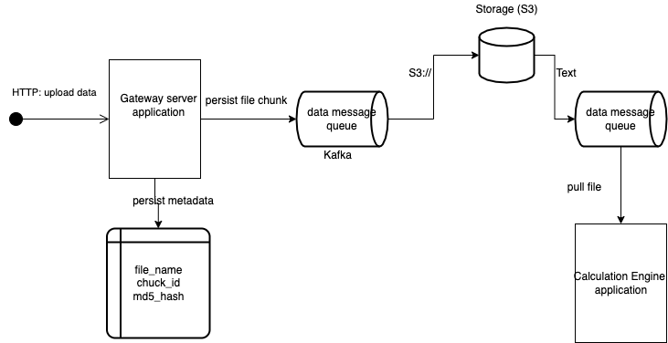

# Data Calculation task

## Install
This is application is fully built by docker, so that it requires docker daemon installed on your host machine:
- [server](server/Dockerfile)
- [ui](ui/Dockerfile)

Start the application:
1. run build script
```bash
bash build.sh
```
2. open `http://127.0.0.1` via your favourite browser


3. you can also access openAPI specs, open `http://127.0.0.1:8000/docs`


## server side design
The server is designed by MVC structure (controller, service and model), which offers APIs for both HTTP and Websocket transactions.
### Http interface for importing data by CSV file
On handling data processing, it uses built-in fastapi's background tasks to defer the data processing asynchronously. API would respond file accepted once it passes validation


### Websocket interface for client keeps pulling data
Using websocket has advantages over http transaction regarding polling data. With couple of aspects:
- Websocket is an event driven protocol, means client can receive data once it's available, instead of constantly sending request for data updates
- Websocket keeps a single, persistent connection open during its lifecycle, which helps mitigate latency issue along with HTTP request/response mechanism


## Future improvement
In terms of improving application's scalability, we could do by several aspects:
1. Hanlding large file upload
Usually HTTP payload has 2 GigaBytes limit, also transmitting speed usually depends on client's network specifications, any HTTP error happens during transmission would 
result in uploading process start over again. 
Based on that
- we can do on client (UI) side, which could breaks down a large file into relative small chunks, marked by `ChunkID`, then transmits by calling API as number of times as 
the amount of chunks it splitted to. Client kepps track of states of chunks, especially for complete chunks, if an error occurs during uploading, the procuss can restart from the latest index of complete `ChunkID`

- server should also persist file hash (such as MD5) as a metadata, so that if a chunk of file uploaded to server already, it can validate so that client could move onto next chunk immediately

2. Streaming the data/files

In terms of we have multiple clients uploading files, we should better decompose application into API server and Calculation engine application.
- API server is designated handle HTTP request of uploading file, persist metadata of files
- Calculation engine for processing file into results.
We can leverage data streaming, by introducing cloud storage (AWS S3) and message queue (Kafka)
As message queue is ordered, it guarantees files stored as the same order as uploaded


